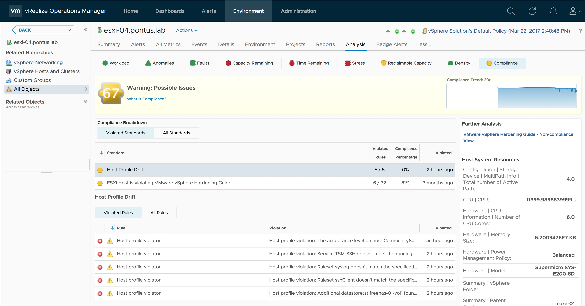

# Importing host propeties
Imports host properties to vRealize Operations

## What it is
A simple script for importing host properties/settings as properties in vRealize Operations. This could be very useful when alerting on e.g. configuration drift by expanding the number of properties visible to vRealize Operations.

## How it works
The script interrogates a vCenter server about all its hosts and pulls host properties according to a filter specified by the user. While you could technically pull all properties, it's not advisable due to the number of properties and the volume of data generated.

## How to run it
Prerequisites: Requires that python 2.x and pip are installed.

1) Download the code 
2) Go to the directory you put the core in and run the following to install dependencies:
    pip install -r requirements.txt
3) Create a configuration file. You need to specify credentials for vCenter and vRealize Operations as well as a filter pattern. The pattern allows file system-like wildwards like "NFS.*". Here is an example:

```yaml
# vCenter details
#
vcHost: "my-vcenter.corp.local"
vcUser: "pontus@corp.local"
vcPassword: "secret"
   
# vR Ops details
#
vropsUrl: "https://my-vrops.corp.local"
vropsUser: "demouser"
vropsPassword: "secret"
   
# Property pattern
#
pattern: "NFS.*"
```
4) Run it:
```bash
python import-props.py --config path/to/config/file
```
5) (Optional) The script only imports properties once. If you want it to run periodicall, you should use cron or Windows scheduled tasks. Recommended interval is once every hour, since the collection takes a fairly long time and host properties aren't likely to change very often.

# Checking hosts against host profiles
The import-host-profiles.py script runs a check of host profies against hosts and imports the results as notification events into vRealize Operations. It is installed and configured the same way as the import-props.py script (see above).

In addition, you probably want to import the alert.xml alert definition into vRealize Operations. This will create symptoms and compliance alerts that are triggered by the notification events fired when a host is out of compliance with its host profile.

## How to run it
Install and configure the same way as described for the property import script (see above). Run it as follows:

```bash
python import-host-profiles.py --config path/to/config/file
```
## What it looks like
Once you have imported the alert definition and captured some host profile violations, you should see them under the Analysis->Compliance sub tab.


